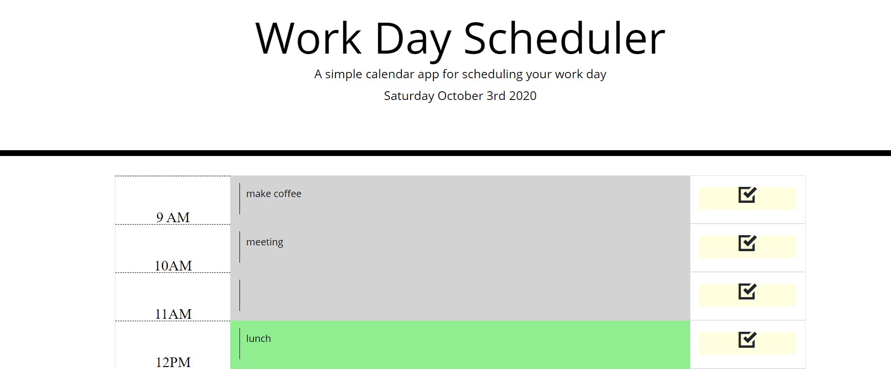
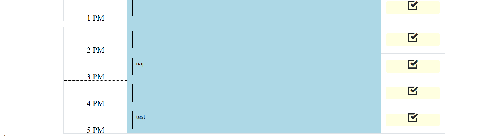

# Work Day Scheduler
# Description

Work Day Scheduler was created to keep track of daily tasks. Based on the standard workday of 9am-5pm, there are text areas to enter notes, or tasks that correspond to the hour of the day. When the hour is current, the row will be green, when the hour is passed, the row will be gray, and when the hour is in the future, the row will be blue. When the page is refreshed, the entered content will remain in the time blocks.

# Images 
   

# Links
 https://jgrossh2.github.io/work-scheduler/

# Technologies used
 *HTML  
 *CSS  
 *Javascript  
 *JQuery 
 

 # Contributions
 Created by Joanna Grosshans, any questions please contact <joannagrosshans2@gmail.com>
